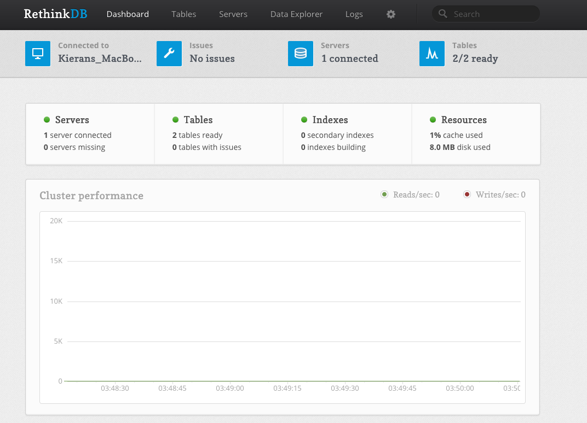

# Flask and RethinkDB Todo List

A simple todo list with the following features:

* User account creation and login
* Listing a user's todos
* Adding todos
* Deleting todos
* Marking todos as complete/incomplete


## Table of Contents
- [How to install/use](#how-to-installuse)
- [How to navigate this project](#how-to-navigate-this-project)
- [How I worked on this project](#how-i-worked-on-this-project)
    - [Choosing a file structure](#choosing-a-file-structure)
    - [Managing database connections](#managing-database-connections)
    - [Initializing the app and connecting to the database](#initializing-the-app-and-connecting-to-the-database)
    - [Views & Routes](#views--routes)
    - [Thinking through the frontend vs backend](#thinking-through-the-frontend-vs-backend)
- [If I had more time what would I change](#if-i-had-more-time-what-would-i-change)

## How to install/use

First you can navigate to [this](https://rethinkdb.com/docs/install/) page to install RethinkDB to your system. Then, you can install the RethinkDB Python drivers globally or within your virtual environment using `sudo pip install rethinkdb`.

To make sure it is working, run the command `rethinkdb`. If you then go to: http://localhost:8080/ you should see the dashboard for RethinkDB.



To test the Python drivers run the following commands:
```
$ python
>>> from rethinkdb import RethinkDB
>>> r = RethinkDB()
>>> r.connect('localhost', 28015).repl()
```

What you get back should be similar to `<rethinkdb.net.DefaultConnection object at 0x100f6cc80>` if everything is working properly.

Install the packages from the requirements file.

Navigate the the directory containing the project folder `flaskr`, and run the following command: `flask --app flaskr init-db`.

This should initialize your RethinkDB database.

Then, you should be good to run the app: `flask --app flaskr run` or `flask --app flaskr run --debug` if you are going to be making changes. You should see something similar to the following:

```
 * Serving Flask app 'flaskr'
 * Debug mode: off
WARNING: This is a development server. Do not use it in a production deployment. Use a production WSGI server instead.
 * Running on http://127.0.0.1:5000
Press CTRL+C to quit
```


## How to navigate this project

Within `flaskr/` are the app factory `__init__.py`, the database management functions `db.py`, as well as the todo and user authentication logic `todos.py` and `auth.py`, respectively. `flaskr/static/` includes static files such as the styling `style.css` and supporting JavaScript `todo.js`. `flaskr/templates/` includes the HTML files with `layout.html` being a template for flashing error messages, `base.html` being the main page, and `flaskr/templates/auth` including the login and register pages.

THe file structure:

```
├── README.md
├── flaskr
│   ├── __init__.py
│   ├── auth.py
│   ├── db.py
│   ├── static
│   │   ├── style.css
│   │   └── todo.js
│   ├── templates
│   │   ├── auth
│   │   │   ├── login.html
│   │   │   └── register.html
│   │   ├── base.html
│   │   └── layout.html
│   └── todos.py
└── requirements.txt
```

## How I worked on this project

I worked on this project with the goal of familiarizing myself with Flask and RethinkDB, as well as getting some more experience with frontend work. I referenced various articles, documentation, and demo projects to get an idea of how I wanted to structure my web app and what features I wanted it to have. To establish my workflow I began by asking myself a number of important questions:
* How do I want to structure my project? I want it to be modular, but I also need to consider that my project is small and should be simple and easy to navigate
* How am I going to manage database connections? I need a robust method that can be easily used throughout the rest of my project
* How will I initialize the Flask application and connect it to the database?
* What sort of views and routes do I need?
* What logic should be performed in the frontend and what should be done in the backend?
* How can I use styling to make my project look nice?

### Choosing a file structure

One thing I found when looking at small todo list projects was that often modularity was not a big focus. This makes a lot of sense, since most of the time these projects are so small that it makes more sense to adopt a more basic file structure. After going over a number of demo Flask web apps it seemed to me that the most effective way to achieve some degree of modularity while maintaining a simple file structure was with Flask blueprints.

[This](https://realpython.com/flask-blueprint/)[^4] article outlines a completely modular setup with blueprints. When considering the scale of my project and the components I wanted to include I found it would be better to implement blueprints with a more simple file structure that could be made more modular if needed. I ended up adopting the project layout detailed [here](https://flask.palletsprojects.com/en/2.3.x/tutorial/layout/)[^6], leaving the files for database logic, logic related to the todos, and logic related to user authentication in the root project folder `todo-app/flaskr/`, and using separate folders for different pages within my `todo-app/flaskr/templates/` directory.

### Managing database connections

To manage database connections I followed [this](https://fjebaker.github.io/notes/python/flask/rethink-db-with-flask.html)[^2] instantiation of RethinkDB with Flask. It ensures that only one database connection is active at all times by checking for a connection at the beginning of a request and only establishing one if needed. It does this by assigning custom functions to Flask's `app.before_request()` and `app.teardown_appcontext()`.

With this a connection can be accessed anywhere in my project with `g.get_conn`.

One thing I added to the database management was a database initialization function, `init_db()`, that checks if the database and tables exist and creates them if not. The intialization function gets registered as a terminal command so that the database can be easily initialized before running the flask application with `flask --app flaskr init-db`.

### Initializing the app and connecting to the database

I made use of the application factory [here](https://flask.palletsprojects.com/en/2.3.x/tutorial/factory/)[^1] in `todo-app/flaskr/__init__.py`, which initializes the Flask app with a config if specified and registers blueprints for managing the database, user authentication, and interacting with todos.

### Views & Routes

To construct the views and routes for my web app I started with the basic functionalities and added things like user authentication later on. I based my views for interacting with todos on the ones included in [this demo todo app](https://github.com/rethinkdb/rethinkdb-example-flask-backbone-todo)[^5]. Sorting was added into the view that retrieves todos so that the most recently added todos would appear at the top of the list and completed todos would appear at the bottom of the list.

They have query with user information so that users can only interact with their own todos.

[This portion](https://flask.palletsprojects.com/en/2.3.x/tutorial/views/)[^3] of a Flask demo app was used as a reference for my user authentication views. When a user registers, their username is checked against the database to avoid duplicates. When a user is logged in their user id, the primary key for the user table, ir stored in the session and used in any further requests for the remainder of the session.

All of the views that involve interaction with todos have been made to require a user login, so a user must be logged in before being redirected to the main page of the web application.

### Thinking through the frontend vs backend

I wanted to make it so that todos would be sorted first by whether they are complete or not (with completed todos being at the bottom) and second by creation date, with the newest todos appearing at the top. The challenge with this was that when a todo was toggled to complete/incomplete, the list would need to be resorted so that it would appear in the correct position. If the only sorting happening were in the backend, the entire list of todos would have to be fetched every time there was a change in ordering.

To solve this problem and limit the number of requests as much as possible, the following measures were taken:
- New todos are always added to the top of the list
- When a todo is created, it is created with a timestamp. When todos are fetched they are added to the page with that attribute
- When a todo is toggled, a sorting function is called and all todos on the page are resorted according to their completedness (whether they are checked or not) and timestamp

This way, the only time todos are retrieved from the database is when the page is refreshed. Adding, deleting, and toggling todos is dynamically rendered on the page.

## If I had more time what would I change?

In the future I would like to add unit testing to this project, as well as some more advanced features such as subtasks and reminders/forcing users to complete their tasks.

I would also like to add displayed timestamps for the todos to the page.

[^1]: Application setup. Application Setup - Flask Documentation (2.3.x). (2010). https://flask.palletsprojects.com/en/2.3.x/tutorial/factory/
[^2]: Baker, F. (2021). Using RethinkDB with Flask. notes. https://fjebaker.github.io/notes/python/flask/rethink-db-with-flask.html
[^3]: Blueprints and views. Blueprints and Views - Flask Documentation (2.3.x). (2010). https://flask.palletsprojects.com/en/2.3.x/tutorial/views/
[^4]: Garcia, M. (2021, February 6). Use a flask blueprint to architect your applications. Real Python. https://realpython.com/flask-blueprint/
[^5]: neumino, mglukhovsky, coffeemug, danielmewes. (2021). rethinkdb-example-flask-backbone-todo. GitHub. https://github.com/rethinkdb/rethinkdb-example-flask-backbone-todo
[^6]: Project layout. Project Layout - Flask Documentation (2.3.x). (2010). https://flask.palletsprojects.com/en/2.3.x/tutorial/layout/
